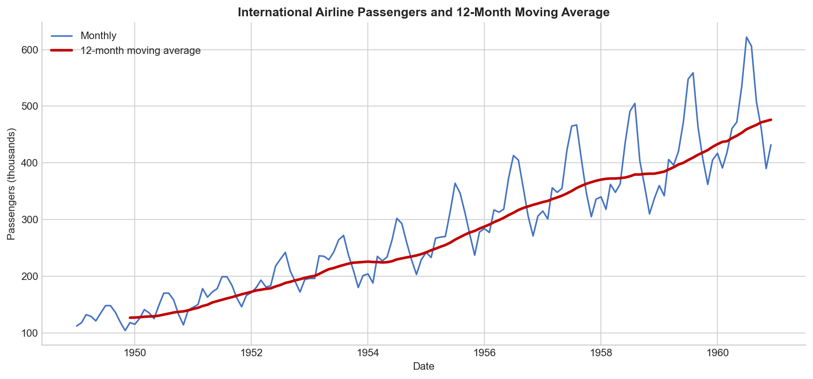
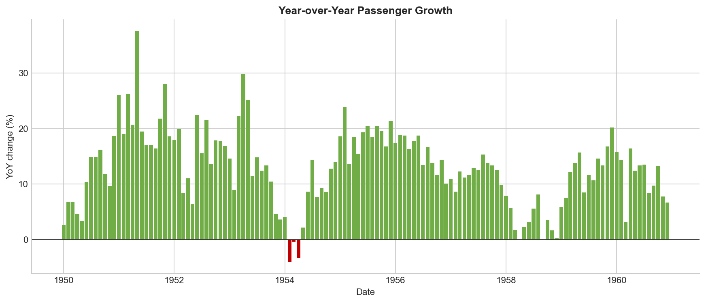
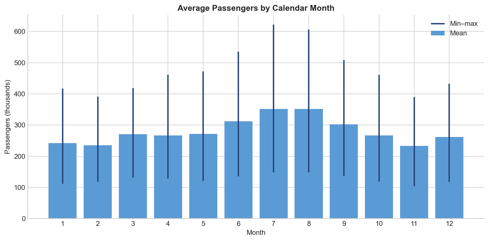
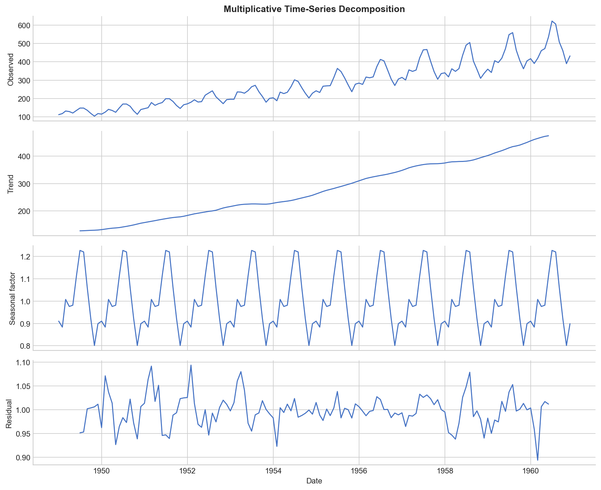
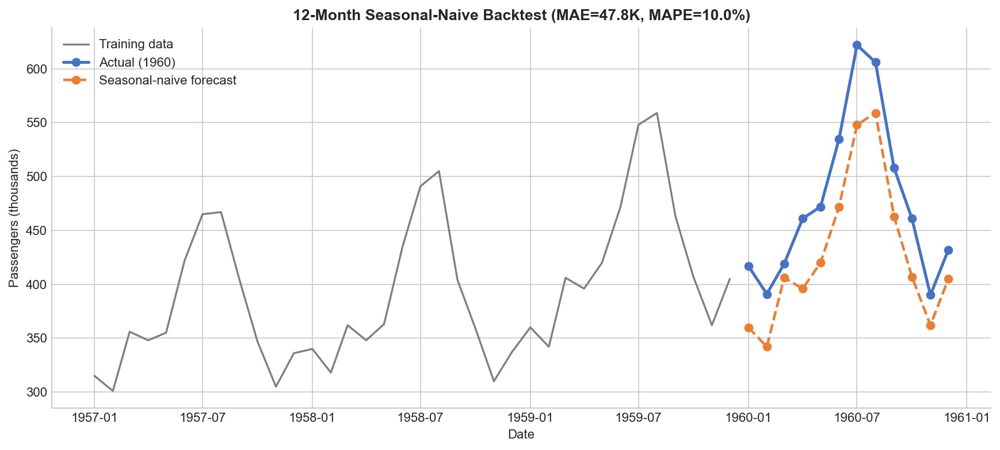

# 1949~1960년 국제선 승객 수 추세·계절성 분석 리포트

## 1. 분석 주제 및 선정 이유

이 보고서는 1949년 1월부터 1960년 12월까지의 월별 국제선 승객 수가 장기적으로 어떻게 변했고, 같은 해 안에서 어떤 계절 패턴을 보였는지 분석한다. 이 데이터는 144개의 연속된 월별 관측치를 포함해 과제의 최소 기준인 100개를 충족하며, 추세와 계절성을 동시에 학습하기에 적합하다.

단순히 “승객 수가 늘었다”는 결론에 그치지 않고 다음 세 가지를 구분하는 데 초점을 두었다.

- **트렌드**: 여러 해에 걸친 장기적인 증가 또는 감소
- **계절성**: 12개월 주기로 반복되는 월별 패턴
- **노이즈**: 추세와 계절성으로 설명되지 않는 불규칙한 변화

## 2. 분석 질문

1. 1949~1960년 국제선 승객 수에는 장기적인 증가 추세가 있었는가?
2. 특정 월에 승객이 반복적으로 많거나 적은 계절성이 존재하는가?
3. 전년 동월 대비 성장률이 가장 높거나 낮았던 시점은 언제인가?
4. 단순한 계절 나이브 방식만으로 다음 12개월을 어느 정도 예측할 수 있는가?

## 3. 데이터 설명

| 항목 | 내용 |
|---|---|
| 데이터셋 | R 기본 데이터셋 `AirPassengers` |
| 기간 | 1949-01-01 ~ 1960-12-01 |
| 빈도 | 월별 |
| 데이터 포인트 | 144개 |
| 핵심 변수 | `passengers_thousands`(국제선 승객 수, 천 명 단위) |
| 공식 설명 | [R AirPassengers 문서](https://stat.ethz.ch/R-manual/R-devel/library/datasets/html/AirPassengers.html) |
| 수집 경로 | [Rdatasets 공개 CSV 미러](https://github.com/vincentarelbundock/Rdatasets/tree/master/csv/datasets) |
| 원전 | Box, Jenkins and Reinsel, *Time Series Analysis, Forecasting and Control*, Series G |

### 3.1 데이터 정제

1. `time`을 월 시작일 형태의 `date`로 변환하고 날짜순으로 정렬했다.
2. 전체 월 인덱스(1949-01~1960-12)로 재색인해 행 자체가 빠진 월도 검사했다.
3. 결측치는 **0개**, 중복 날짜도 **0개**였다. 따라서 실제 보간이나 행 제거는 발생하지 않았다. 코드에는 결측치가 있을 경우 선형 보간하도록 재현 가능한 기준을 명시했다.
4. 원시 승객 수는 강한 상승 추세가 있어 값 자체에 IQR 기준을 적용하면 후반부의 정상적인 고수요를 이상치로 잘못 분류할 수 있다. 따라서 전월 대비 변화율에 IQR 1.5배 기준을 적용했다. 탐지 경계는 **-35.98%~39.46%**였고, 해당 범위를 벗어난 변화는 **0개**였다.
5. 변화가 크더라도 실제 항공 수요의 계절성일 수 있으므로, 탐지된 값이 있더라도 자동 삭제하지 않고 별도 플래그로만 기록하도록 설계했다.

정제 결과는 [`data/air_passengers_clean.csv`](data/air_passengers_clean.csv)에 저장했다.

## 4. 분석 방법

최소 2개 기법 기준을 넘어 다음 네 가지를 적용했다.

1. **12개월 이동평균**: 한 해 안의 계절 변동을 완화해 장기 추세를 확인했다.
2. **변화율**: 전월 대비 변화율과 전년 동월 대비 변화율을 계산했다. 특히 전년 동월 대비는 같은 계절끼리 비교해 계절 효과를 줄인다.
3. **월별 집계**: 12년간 각 달의 평균·최솟값·최댓값을 비교해 반복되는 계절 패턴을 확인했다.
4. **곱셈형 시계열 분해**: 승객 수가 커질수록 계절 진폭도 커지는 형태를 반영해 `관측값 = 추세 × 계절 × 잔차`로 분해했다.

보너스 과제로 마지막 12개월(1960년)을 검증 구간으로 숨기고, 12개월 전 같은 달의 값을 예측값으로 사용하는 **계절 나이브 예측**도 수행했다.

## 5. 분석 결과 및 시각화

### 5.1 장기 추세와 12개월 이동평균



- **관찰(Fact)**: 월별 승객 수는 1949년 1월 112천 명에서 1960년 12월 432천 명으로 **285.71% 증가**했다.
- **관찰(Fact)**: 12개월 이동평균은 초기 126.67천 명에서 마지막 476.17천 명으로 **275.92% 증가**했다.
- **관찰(Fact)**: 연복리 증가율(CAGR)은 약 **11.99%**였다.
- **해석(Hypothesis)**: 단기적인 월별 등락과 별개로 국제선 항공 수요의 구조적인 확대가 있었을 가능성이 높다. 다만 이 데이터만으로 소득 증가, 항공 공급 확대 등 구체적인 원인을 확정할 수는 없다.

### 5.2 전년 동월 대비 성장률



- **관찰(Fact)**: 가장 높은 전년 동월 대비 성장률은 1951년 5월의 **37.60%**였다.
- **관찰(Fact)**: 가장 낮은 성장률은 1954년 2월의 **-4.08%**였다.
- **해석(Hypothesis)**: 장기적으로 성장했지만 모든 달이 일관되게 증가한 것은 아니다. 단기 충격 또는 기저효과가 있었을 수 있으나, 사건·경제 변수 데이터가 없으므로 원인을 단정하지 않는다.

### 5.3 월별 계절성



- **관찰(Fact)**: 12년간 7월 평균은 **351.33천 명**, 11월 평균은 **232.83천 명**이었다.
- **관찰(Fact)**: 7월 평균은 11월보다 **50.89% 높았다**.
- **관찰(Fact)**: 전체 최댓값은 1960년 7월 **622천 명**, 최솟값은 1949년 11월 **104천 명**이었다.
- **해석(Hypothesis)**: 여름철 이동 수요가 높고 늦가을 수요가 낮은 계절 패턴이 반복된 것으로 보인다. 구체적인 여행 목적이나 지역별 휴가 시기는 데이터에 포함되지 않아 원인 가설로만 제시한다.

### 5.4 시계열 분해(보너스)



- **관찰(Fact)**: 추세 성분은 분석 기간 대부분에서 상승했고, 계절 성분은 약 12개월 주기로 반복됐다.
- **관찰(Fact)**: 원자료의 수준이 높아질수록 여름 고점과 겨울 저점의 절대 격차도 커졌다.
- **해석(Hypothesis)**: 계절 변동폭이 고정된 덧셈형보다 수준에 비례하는 곱셈형 구조가 이 데이터에 더 자연스럽다.

### 5.5 계절 나이브 예측 검증(보너스)



- **관찰(Fact)**: 1959년 같은 달의 값을 1960년 예측값으로 사용했을 때 MAE는 **47.83천 명**, MAPE는 **9.99%**였다.
- **관찰(Fact)**: 계절적 고점과 저점의 시기는 따라갔지만, 성장 추세가 반영되지 않아 실제값을 전반적으로 낮게 예측했다.
- **해석(Hypothesis)**: 계절성만으로도 방향은 설명할 수 있지만, 실용적인 예측에는 상승 추세까지 함께 반영하는 모델이 필요하다.

## 6. 핵심 인사이트

### 인사이트 1 — 장기 성장과 계절 변동은 동시에 존재한다

- **관찰**: 시작 대비 마지막 값은 285.71% 증가했고 12개월 이동평균도 275.92% 증가했다.
- **해석**: 월별 등락만 보면 불규칙해 보이지만 이동평균으로 보면 장기 성장은 명확하다.
- **행동 제안**: 장기 의사결정에는 원시 월별 값보다 이동평균이나 추세 성분을 함께 사용한다.

### 인사이트 2 — 수요 계획에서는 달력 월이 중요한 변수다

- **관찰**: 7월 평균은 11월보다 50.89% 높았다.
- **해석**: 같은 연도 안에서도 계절에 따라 필요한 항공 공급·인력·운영 용량이 크게 달라질 수 있다.
- **행동 제안**: 월별 평균만 사용하는 대신 계절 지수를 반영해 성수기와 비수기를 별도로 계획한다.

### 인사이트 3 — 전년 동월 비교가 전월 비교보다 장기 성장 판단에 적합하다

- **관찰**: 월별 값은 여름 이후 급감하는 패턴을 반복하지만, 전년 동월 성장률은 대부분 양수였다. 최고 37.60%, 최저 -4.08%였다.
- **해석**: 계절적 하락을 사업의 구조적 하락으로 오해하지 않으려면 같은 달끼리 비교해야 한다.
- **행동 제안**: 월간 대시보드에는 전월 대비와 전년 동월 대비 지표를 동시에 표시한다.

### 인사이트 4 — 단순 예측은 기준선으로 유용하지만 최종 모델로는 부족하다

- **관찰**: 계절 나이브 예측의 MAPE는 9.99%였고, 성장 추세 때문에 실제값을 대체로 과소예측했다.
- **해석**: 10% 내외의 오차는 비교 기준으로 유용하지만 추세가 강한 데이터에서는 체계적인 편향이 생긴다.
- **행동 제안**: 다음 분석에서는 추세를 포함한 Holt-Winters 또는 SARIMA를 적용하고 동일한 검증 구간에서 계절 나이브와 비교한다.

## 7. 결론 및 한계점

국제선 승객 수에는 약 12%의 연복리 장기 성장과 12개월 주기의 강한 계절성이 함께 나타났다. 특히 7월 평균 수요가 11월보다 약 51% 높아, 장기 추세만으로는 실제 월별 수요를 충분히 설명할 수 없다. 계절 나이브 방식은 계절의 방향을 재현했지만 성장 추세를 놓쳐 1960년을 전반적으로 과소예측했다.

이 분석에는 다음 한계가 있다.

1. 승객 수 하나만 사용했으며 GDP, 운임, 항공편 공급, 유가, 정책·사건 등 외부 변수를 반영하지 않았다.
2. 데이터가 1949~1960년에 한정된 고전 데이터이므로 현재 항공 시장에 그대로 일반화할 수 없다.
3. 월별 총계라서 국가·노선·여행 목적별 차이를 알 수 없다.
4. 이상치 판단은 통계 기준일 뿐 사건의 정상·비정상 여부를 확정하지 못한다.
5. 예측 검증은 한 번의 12개월 홀드아웃만 사용했다. 여러 시점의 롤링 검증이 더 안정적이다.

## 8. 재현 방법

Python 3.10 이상에서 다음 명령을 실행한다.

```bash
python -m venv .venv
.venv\Scripts\activate
python -m pip install -r requirements.txt
python analysis.py
```

자세한 폴더 구조와 데이터 수집 방법은 [`README.md`](README.md)에 기록했다. 분석에 사용한 라이브러리와 버전은 [`requirements.txt`](requirements.txt)에 고정했다.

## 9. AI 사용 로그

| 사용 작업 | 사용 이유 | 검증 방법 |
|---|---|---|
| 프로젝트 구조 및 전처리 코드 초안 작성 | 반복 작업 시간을 줄이고 누락된 요구사항을 방지하기 위해 사용 | 원본 144행과 정제 144행을 대조하고 날짜 중복·결측치 수를 코드로 재검사함 |
| 이동평균·변화율·월별 집계·분해·예측 코드 작성 | 여러 분석 대안을 빠르게 비교하기 위해 사용 | 스크립트를 처음부터 다시 실행해 CSV·요약 JSON·PNG 5개가 동일하게 생성되는지 확인함 |
| 그래프 구성과 설명 문장 다듬기 | 관찰과 해석을 명확히 분리하기 위해 사용 | 그래프의 수치와 `analysis_summary.json`의 집계값을 대조하고, 원인 단정 표현을 가설로 낮춤 |
| 인사이트 후보 도출 | 그래프를 나열하지 않고 의사결정 의미를 탐색하기 위해 사용 | 각 인사이트에 실제 수치가 포함됐는지 확인하고 데이터로 검증되지 않은 원인은 한계점에 명시함 |

최종 해석은 그래프와 산출 통계를 근거로 검토했으며, AI가 제안한 설명 중 데이터만으로 확정할 수 없는 내용은 가설로 표시했다.
